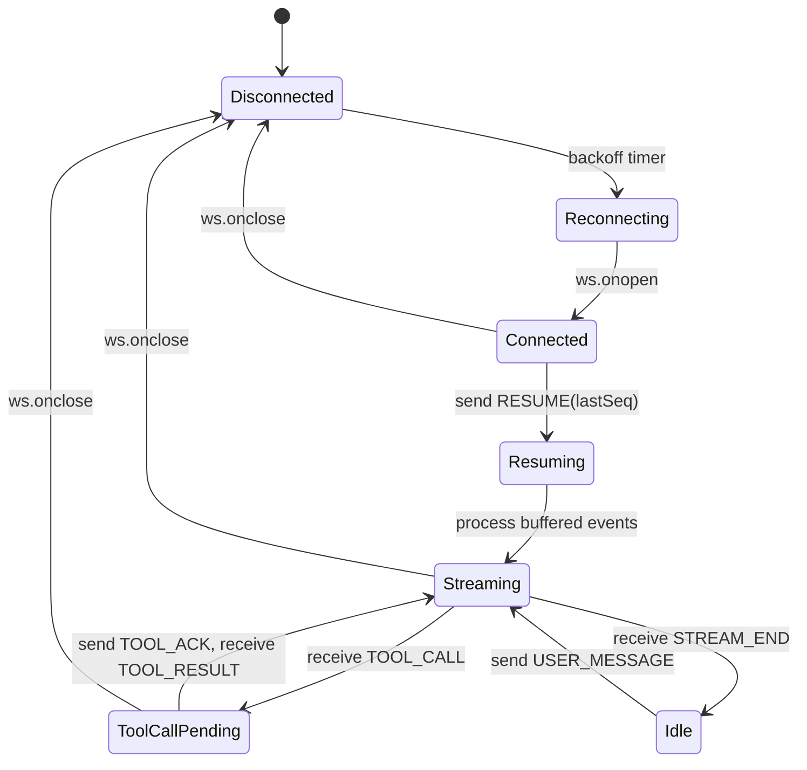

# Alchemyst AI - Agent Console

## Architectural Summary
The architecture separates the pure WebSocket protocol logic from the React rendering layer using a custom `useAgentWebSocket` hook tied to a reducer state machine. To handle Chaos Mode out-of-order events, I implemented a `seq`-based buffer that strictly validates continuity before dispatching actions. The chat renderer maps over a unified array of mixed events (Text Nodes and Tool Cards) to prevent any DOM layout shift during mid-stream interruptions, while a lazy-rendering recursive component combined with a custom object differ ensures the UI doesn't freeze when rendering massive 500KB+ JSON schemas.

## State Machine Diagram


## Instructions to Run

1. **Start the backend server:**
```bash
cd agent-server
npm install
npm start
# Or for Chaos Mode: npm start -- --mode chaos
```

2. **Start the frontend application:**
```bash
cd agent-console
npm install
npm run dev
```

3. Open `http://localhost:3000` in your browser.

## Screenshots
